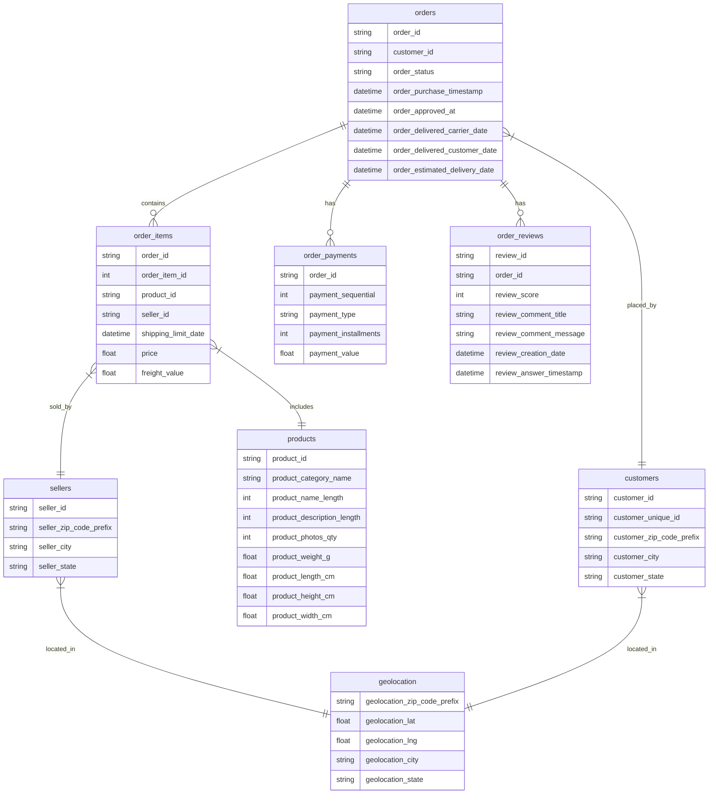
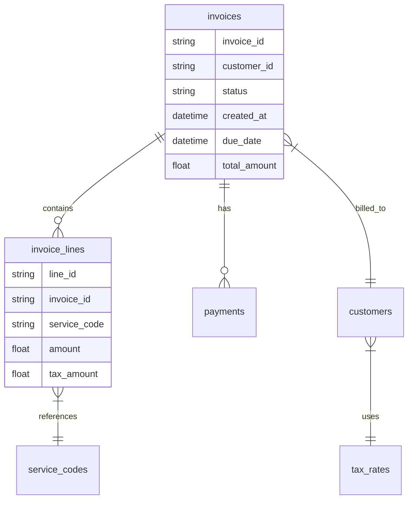

### llm_assignment_priyanka
This repository is created to do the assignment for KISS ❤️ LLM LAB
To run
pip3 install -r requirements.txt
export OPEN_AI_API_KEY="<fill your key here>"
python3 application.py
python -m unittest test_application.py
copy instance of database from here https://www.kaggle.com/datasets/terencicp/e-commerce-dataset-by-olist-as-an-sqlite-database/data

# KISS ❤️ LLM LAB Entry Assignment

## Building a Simple LLM-to-SQL Pipeline

### Objective:
Create a script that demonstrates your ability to work with LLMs and databases by building a basic prompt-to-query pipeline.

### Database:
[SQLite database](https://www.kaggle.com/datasets/terencicp/e-commerce-dataset-by-olist-as-an-sqlite-database/data) (provided on Feb 14, 2025)

### Resources:
You can use either:
- Any LLM and any coding language you prefer
- [OpenAI GPT-4](https://platform.openai.com/docs/overview) (free $18 - I recommend to use this one)
- [Google AI Studio](https://aistudio.google.com/welcome) (free $20 credit available with personal Google account)
- [Anthropic API Claude models](https://docs.anthropic.com/en/docs/initial-setup) (free $8 per month on `Free Tier`)

🤖 Pro Tip: For any unclear details - feed this assignment into ChatGPT or Claude and ask it.
They'll be happy to explain everything in detail!

**Note:** All data used in this assignment is from open sources and can be shared freely.

### Technical Requirements:
- Just KISS it.
    - Keep code under 100 lines in Python (excluding prompts and tests)
    - It can be bigger for other bloated languages
- Must include unit tests
- Must handle basic error cases
- Must use proper logging
- Any language you like and can run locally

### Core Questions to Answer (to be extended):
1. What is the accuracy of LLM-generated SQL queries compared to human-written ones in the database?
2. Which types of questions result in the highest/lowest accuracy? Provide examples.
3. How would you implement a safety check for potentially harmful SQL queries?
4. What metrics would you use to evaluate the quality of generated SQL queries?
5. How would you handle edge cases like:
   - Infinite recursion in query generation
   - Malicious queries attempting to modify database structure
   - Ambiguous natural language questions

### Bonus Questions:
6. How would you implement query caching to improve performance?
7. What prompt engineering techniques could improve SQL generation accuracy?
8. How would you implement a feedback loop to improve query generation over time?

### Evaluation Criteria:
- Code quality and organization
- Test coverage
- Error handling
- Documentation
- Analysis depth

### Additional Requirements:
- All code must be executable during the 15-minute code review session
- Questions must be implemented as runnable test cases
- Code should be organized to demonstrate functionality quickly
- Language: Any IDE-supported language accepted
- Include setup instructions if using non-standard dependencies

### Submission Details:

🗓️ Deadline: Sunday, February 23rd, 2025

📤 How to submit:
- Email to: dmitry.buykin@maersk.com
  OR
- Direct message in Microsoft Teams to `Dmitry Buykin`

📋 Review Process:
- 15-minute code review session will be scheduled
- Be prepared to run and explain your code
- Have your development environment ready for the review

## Detailed Questions
The LLM should be able to generate SQL queries to answer the following questions correctly:

1. Which seller has delivered the most orders to customers in Rio de Janeiro? [string: seller_id]

2. What's the average review score for products in the 'beleza_saude' category? [float: score]

3. How many sellers have completed orders worth more than 100,000 BRL in total? [integer: count]

4. Which product category has the highest rate of 5-star reviews? [string: category_name]

5. What's the most common payment installment count for orders over 1000 BRL? [integer: installments]

6. Which city has the highest average freight value per order? [string: city_name]

7. What's the most expensive product category based on average price? [string: category_name]

8. Which product category has the shortest average delivery time? [string: category_name]

9. How many orders have items from multiple sellers? [integer: count]

10. What percentage of orders are delivered before the estimated delivery date? [float: percentage]

Your implementation should:
- Generate accurate SQL queries for each question
- Handle the data relationships correctly
- Return results in the expected format
- Include error handling for edge cases
- Have proper unit tests for each question

## Dataset and Schema
For this assignment we will use an open dataset [E-commerce dataset by Olist](https://www.kaggle.com/datasets/terencicp/e-commerce-dataset-by-olist-as-an-sqlite-database/data) from Kaggle.



## 💡 Pro Tip: Writing Effective LLM Prompts

Modern LLMs work exceptionally well with structured markdown text! Here's a ready-to-use prompt template that you can feed directly to any LLM (just copy the content between the backticks):

Feed this markdown-formatted prompt to LLM:

````markdown
You are an expert in SQLite, Python and data analysis.
You work at Maersk's Invoice Processing Department analyzing global shipping invoices.
Given a user request, respond with a python code to carry out the task.

User already has a running Jupyter notebook with an available SQLite database. The first cell of the notebook has some helper routines to interact with it:

```python
import pandas as pd
import numpy as np
import sqlite3

def query(q: str):
    with sqlite3.connect('maersk_invoices.db') as conn:
        df = pd.read_sql_query(q, conn)
        for col in df.columns:
            if "Date" in col or "Timestamp" in col:
                df[col] = pd.to_datetime(df[col], errors='coerce')
    return df
```

Tables in this SQLite database:
- invoices (500k rows): Main invoice records, includes status and dates
- invoice_lines (2M rows): Individual line items with amounts in USD cents
- customers (50k rows): Customer details with VAT numbers and addresses
- service_codes (100 rows): Service definitions and categories 
- payments (800k rows): Payment records linked to invoices
- tax_rates (200 rows): VAT and tax rules by country

// Some [Exploratory Data Analysis](https://en.wikipedia.org/wiki/Exploratory_data_analysis) can be added as well to improve quality of queries

A few important conventions:
1. All monetary values are in USD cents
2. All dates are in UTC timezone
3. Service codes follow Maersk's 4-letter format (e.g., 'FREU' for freight)
4. Customer IDs use the SAP format
5. For tables - return DataFrame, for reports - return markdown

Database schema is attached below. Note the relationships between invoices, customers and services.


````

✨ Why markdown format works great with LLMs:
1. 🎯 Clear structure that LLMs can parse easily
2. 📚 Code blocks are properly formatted
3. 🗃️ Lists and tables are well-organized
4. 🔑 Headers provide clear hierarchy
5. 📊 Support for diagrams and charts

Simply copy everything between the triple backticks and feed it to your favorite LLM - it will immediately understand the context and format!
